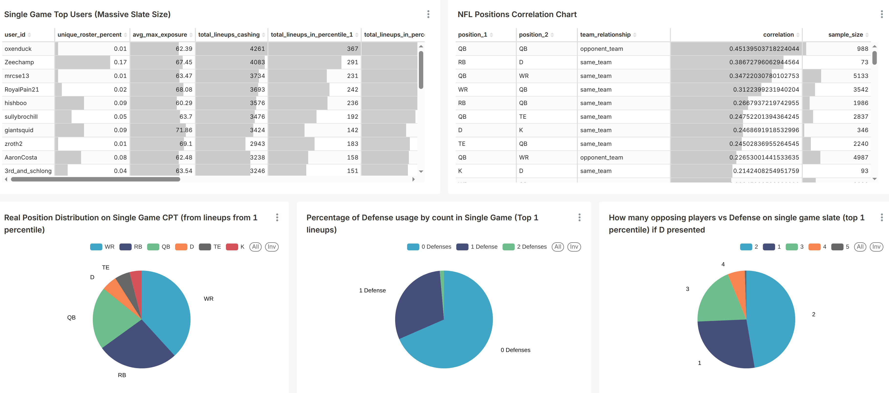

# DFS Analytics Pipeline

> **Аналитический пайплайн для Daily Fantasy Sports (NFL, NHL)**

Проект создан в рамках учебной программы Яндекс Практикум по специальности "Инженер данных", но решает реальную задачу построения экономичной системы аналитики результатов Daily Fantasy Sports (DFS).

---

## 📋 О проекте

### Что такое DFS?

**Daily Fantasy Sports (DFS)** — это формат фэнтези-спорта, где участники создают виртуальные команды из реальных спортсменов и соревнуются на основе их статистики в реальных играх. В отличие от сезонных лиг, DFS-турниры длятся один день или неделю.

**Как это работает в NFL:**
- Игрок выбирает состав из доступных позиций (QB, RB, WR, TE, FLEX, DST)
- Каждому игроку назначена виртуальная "зарплата" на основе прогнозируемой производительности
- Общая сумма зарплат не может превышать лимит (обычно \$50,000 на DraftKings)
- Очки начисляются за реальную статистику в играх
- Побеждают составы, набравшие больше всего очков

### Проблема

Для улучшения результатов в DFS необходим анализ данных:
- Какие составы попадают в топ-1% турниров?
- Какие стратегии используют успешные игроки?
- Существует ли корреляция между позициями?
- Как эффективно использовать стекинг игроков из одной команды?
- Какой процент владения оптимален?
- Как распределять виртуальный бюджет?

Однако профессиональные аналитические платформы стоят дорого, а построение собственной инфраструктуры на AWS требует значительных вложений.

### Решение

Данный проект предлагает **экономичную архитектуру** для хранения и анализа DFS данных:

- ✅ **Дешевое хранилище**: Wasabi S3 (в 5 раз дешевле AWS S3)
- ✅ **Портативность**: Docker Compose для запуска на локальной машине
- ✅ **Облегченная обработка**: DuckDB + Pandas вместо тяжелого Spark
- ✅ **Сохранение состояния**: данные в S3, метаданные в PostgreSQL
- ✅ **Масштабируемость**: архитектура поддерживает добавление других видов спорта
- ✅ **Визуализация**: Apache Superset для создания дашбордов

---

## 🏗️ Архитектура системы

Проект использует классическую **трехслойную модель хранилища данных**:

```
┌──────────────────────────────────────────────────────────────┐
│                      DATA SOURCES                            │
│              Rotogrinders / FantasyLabs API                  │
└───────────────────────────┬──────────────────────────────────┘
                            │
                            ▼
┌──────────────────────────────────────────────────────────────┐
│                    STAGING LAYER                             │
│  ┌────────────────────────────────────────────────────────┐  │
│  │  Raw data: JSONL + gzip compression                    │  │
│  │  Partitioned by: sport / game_type / date              │  │
│  │  Storage: Wasabi S3                                    │  │
│  │  ├─ draft_groups/                                      │  │
│  │  ├─ contests/                                          │  │
│  │  ├─ events/                                            │  │
│  │  ├─ contest_analyze/                                   │  │
│  │  └─ lineups/                                           │  │
│  └────────────────────────────────────────────────────────┘  │
└───────────────────────────┬──────────────────────────────────┘
                            │
                            ▼
┌──────────────────────────────────────────────────────────────┐
│                      DDS LAYER                               │
│              (Data Detail Storage)                           │
│  ┌────────────────────────────────────────────────────────┐  │
│  │  Normalized data: Parquet + Snappy compression         │  │
│  │  Transformed with: DuckDB SQL                          │  │
│  │  Storage: Wasabi S3                                    │  │
│  │  ├─ players/      (игроки, зарплаты, статистика)      │  │
│  │  ├─ users/        (пользователи, метрики успеха)      │  │
│  │  ├─ user_lineups/ (связь пользователь-состав)         │  │
│  │  └─ lineups/      (составы, очки, стекинг)            │  │
│  └────────────────────────────────────────────────────────┘  │
└───────────────────────────┬──────────────────────────────────┘
                            │
                            ▼
┌──────────────────────────────────────────────────────────────┐
│                     MARTS LAYER                              │
│               (Analytical Data Marts)                        │
│  ┌────────────────────────────────────────────────────────┐  │
│  │  Aggregated views: Parquet + Snappy                    │  │
│  │  ├─ top_lineups/          (топ-1-5% составов)         │  │
│  │  ├─ top_users/            (успешные игроки)           │  │
│  │  └─ position_correlations/ (корреляции позиций)       │  │
│  └────────────────────────────────────────────────────────┘  │
└───────────────────────────┬──────────────────────────────────┘
                            │
                            ▼
┌──────────────────────────────────────────────────────────────┐
│                  VISUALIZATION LAYER                         │
│                   Apache Superset                            │
│            (Dashboards, Charts, Analysis)                    │
└──────────────────────────────────────────────────────────────┘
```

### Структура S3 Bucket

```
s3://bucket-name/
├── staging/
│   └── NFL/
│       ├── draft_groups/
│       ├── contests/dk_classic/{date}/data.json.gz
│       ├── contests/dk_single_game/{date}/data.json.gz
│       ├── events/
│       ├── contest_analyze/
│       └── lineups/
├── dds/
│   └── NFL/
│       ├── players/dk_classic/{date}/data.parquet
│       ├── users/dk_classic/{date}/data.parquet
│       ├── user_lineups/dk_classic/{date}/data.parquet
│       └── lineups/dk_classic/{date}/data.parquet
└── marts/
    ├── top_lineups/data.parquet
    ├── top_users/data.parquet
    └── position_correlations/data.parquet
```

---

## 🛠️ Технологический стек

### Оркестрация и обработка данных
- **Apache Airflow 3.1.0** — оркестрация ETL пайплайнов
  - Celery Executor для параллельной обработки
  - Scheduler для автоматического запуска DAG'ов
  - Web UI для мониторинга (порт 8080)
- **DuckDB** — SQL-движок для трансформации данных
- **Pandas** — обработка и анализ данных

### Хранение данных
- **Wasabi S3** — объектное хранилище (совместимо с AWS S3 API)
- **PostgreSQL 18** — хранение метаданных Airflow и Superset
- **Redis 7.2** — брокер сообщений для Celery

### Визуализация
- **Apache Superset** — платформа для создания дашбордов (порт 8088)

### Инфраструктура
- **Docker Compose** — контейнеризация всех сервисов
- **Python 3.10** — основной язык разработки
- **Jupyter Lab 4.4** — интерактивные ноутбуки для исследований (порт 8888)

### О Spark
В `docker-compose.yaml` присутствует настройка Apache Spark (master + 3 workers) **исключительно в учебных целях**. На практике, для работы на одной машине использование Spark избыточно и неэффективно. Вся логика обработки данных реализована на **DuckDB + Pandas**, что обеспечивает:
- Меньшее потребление памяти
- Более быстрый старт обработки
- Простоту разработки и отладки
- Производительность в 5-9 раз выше для данного объема данных

---

## 📊 Аналитические возможности

### Реализованные витрины данных

#### 1. **Top Lineups Mart** (`single_game_dk_top_lineups_mart.py`)
Анализ лучших составов турниров (топ 1-5 перцентиль):
- Состав позиций (QB, RB, WR, TE, FLEX, DST)
- Использование зарплатного бюджета
- Средний процент владения игроков
- Стекинг игроков из одной команды
- Сравнение Classic vs Single Game форматов

**Вопросы, на которые отвечает:**
- Какие составы приводят к победам?
- Стоит ли использовать стекинг QB + WR одной команды?
- Какой оптимальный процент владения игроков?

#### 2. **Top Users Mart** (`top_users_mart.py`)
Анализ стратегий успешных игроков:
- ROI (Return on Investment)
- Количество уникальных составов vs общее количество
- Максимальная экспозиция на игрока (max_exposure)
- Количество профитных составов (lineups_cashing)
- Попадание в разные перцентили (1%, 2%, 5%, 10%, 20%, 50%)
- Сегментация по размеру турнира (Tiny, Small, Medium, Large, Massive)

**Вопросы, на которые отвечает:**
- Какие стратегии используют успешные игроки?
- Сколько уникальных составов оптимально создавать?
- Как управлять риском через max_exposure?

#### 3. **Position Correlations Mart** (`position_correlations_mart.py`)
Анализ корреляции производительности между позициями:
- Корреляция внутри команды (same_team)
- Корреляция между командами-соперниками (opponent_team)
- Статистическая значимость (sample_size > 50)

**Примеры корреляций:**
- QB + WR одной команды (обычно положительная)
- QB команды A + DST команды B (обычно отрицательная)
- RB + WR одной команды (может быть отрицательной из-за game script)

**Вопросы, на которые отвечает:**
- Какие позиции стоит комбинировать в составе?
- Есть ли смысл в стекинге QB + multiple WR?
- Как использовать корреляции для снижения риска?

### Анализируемые метрики

- **Ownership (процент владения)** — в скольких процентах составов используется игрок
- **Stacking (стекинг)** — использование нескольких игроков из одной команды
- **Salary distribution** — распределение бюджета по позициям
- **Percentile performance** — процентное распределение результатов
- **Unique roster %** — разнообразие составов пользователя
- **Cashing rate** — процент прибыльных составов

---

## 🏒 NHL Analytics (MoneyPuck)

Проект включает интеграцию с **MoneyPuck** для анализа NHL данных.

### Источник данных
[MoneyPuck](https://moneypuck.com/) — аналитическая платформа для NHL с детальной статистикой составов линий команд.

### Реализованные компоненты

#### 1. MoneyPuck Scraper
- **Модуль:** `src/scripts/spiders/moneypuck_scraper.py`
- **DAG:** `daily_extra_spiders_scraping_dag.py`
- **Данные:** Составы линий NHL команд (5v5)
- **Формат:** JSONL + gzip в S3

#### 2. MoneyPuck DDS Processor
- **Модуль:** `src/scripts/dds/moneypuck_dds_processor.py`
- **DAG:** `moneypuck_dds_dag.py`
- **Трансформация:** Staging → DDS (нормализованный Parquet)
- **Особенности:**
  - Маппинг названий команд (MoneyPuck → Rotogrinders)
  - Обработка составов линий 5v5 (L1, L2, L3, L4)
  - Интеграция с DFS данными по игрокам

#### 3. NHL Correlations Mart
- **Модуль:** `src/scripts/marts/nhl_correlations_mart.py`
- **Назначение:** Анализ корреляций позиций NHL с учетом составов линий 5v5
- **Аналитика:**
  - Корреляции внутри одной линии (same_line)
  - Корреляции внутри команды (same_team)
  - Корреляции между командами (opponent_team)
  - Интеграция line combinations в стратегии стекинга

### Архитектура данных NHL

```
MoneyPuck API
    ↓
Staging Layer (S3)
    ├── staging/moneypuck/YYYY-MM-DD/lines.jsonl.gz
    ↓
DDS Layer (S3)
    ├── dds/moneypuck/lines.parquet
    ↓
Marts Layer (S3)
    └── marts/nhl_correlations/*.parquet
         ↓
    Apache Superset / Jupyter
```

---

## 🚀 Установка и запуск

### Системные требования

- **ОС**: Linux / macOS / Windows (с WSL2)
- **RAM**: минимум 32GB, рекомендуется 64GB+
- **CPU**: минимум 4 ядра, рекомендуется 8+
- **Disk**: минимум 20GB свободного места
- **Docker**: версия 20.10+
- **Docker Compose**: версия 2.0+

### 1. Клонирование репозитория

```bash
git clone <repository-url>
cd dfs-analytics-pipeline
```

### 2. Регистрация в Wasabi

1. Зарегистрируйтесь на [Wasabi Console](https://console.wasabisys.com)
2. Создайте новый bucket (например, `dfs-analytics`)
3. Получите Access Key и Secret Key в разделе "Access Keys"

### 3. Настройка окружения

Скопируйте пример конфигурации:
```bash
cp .env.example .env
```

Отредактируйте `.env` файл:
```bash
# Airflow
AIRFLOW_PROJ_DIR=./src
AIRFLOW__CORE__LOAD_EXAMPLES=false
AIRFLOW_UID=1000  # Linux: \$(id -u)

# Wasabi S3
WASABI_ENDPOINT=s3.wasabisys.com
WASABI_ACCESS_KEY=ваш-access-key
WASABI_SECRET_KEY=ваш-secret-key
WASABI_BUCKET_NAME=dfs-analytics

# Proxy (опционально, для избежания rate limiting)
PROXY_URL=your_webshare_url

# Superset
SUPERSET_SECRET_KEY=измените-этот-ключ-на-случайную-строку
SUPERSET_DB_HOST=postgres  # или external RDS endpoint
SUPERSET_DB_PORT=5432
SUPERSET_DB_USER=airflow
SUPERSET_DB_PASSWORD=airflow
SUPERSET_DB_NAME=superset
```

**Для Linux:**
```bash
echo "AIRFLOW_UID=\$(id -u)" >> .env
```

### 4. Запуск инфраструктуры

Соберите и запустите контейнеры:
```bash
docker-compose up -d
```

Первый запуск может занять 5-10 минут (загрузка образов, инициализация БД).

### 5. Проверка статуса

```bash
docker-compose ps
```

Все сервисы должны быть в статусе `healthy` или `running`.

### 6. Доступ к сервисам

После успешного запуска доступны следующие интерфейсы:

| Сервис | URL | Логин | Пароль |
|--------|-----|-------|--------|
| **Airflow** | http://localhost:8080 | airflow | airflow |
| **Superset** | http://localhost:8088 | admin | admin |
| **Jupyter Lab** | http://localhost:8888 | — | — |
| **Spark Master UI** | http://localhost:9090 | — | — |
| **Flower (Celery)** | http://localhost:5555 | — | — |

### 7. Запуск DAG'ов

1. Откройте Airflow UI: http://localhost:8080
2. Включите DAG'и:
   - `daily_scraping_dag` — скрапинг данных с Rotogrinders
   - `daily_dds_dag` — трансформация данных в DDS слой
   - `moneypuck_dds_dag` — обработка MoneyPuck данных (NHL)
3. Для ручного запуска нажмите кнопку "Trigger DAG"

### 8. Остановка и удаление

```bash
# Остановка контейнеров
docker-compose stop

# Полное удаление (включая volumes)
docker-compose down -v
```

---

## 📁 Структура проекта

```
dfs-analytics-pipeline/
├── src/
│   ├── dags/                          # Airflow DAG'и
│   │   ├── daily_scraping_dag.py      # Скрапинг Rotogrinders (Staging)
│   │   ├── daily_extra_spiders_scraping_dag.py # Дополнительные источники (MoneyPuck и др.)
│   │   ├── daily_dds_dag.py           # Обработка данных (DDS)
│   │   └── test_scripts_import.py     # Тестовый DAG для проверки импортов
│   │
│   ├── scripts/                       # Python модули
│   │   ├── spiders/                   # Scrapers для различных источников
│   │   │   ├── base_spider.py         # Базовый класс для scrapers
│   │   │   ├── rotogrinders_scraper.py # Scraper для Rotogrinders API
│   │   │   └── moneypuck_scraper.py   # Scraper для MoneyPuck (NHL)
│   │   │
│   │   ├── staging/                   # Загрузка данных в Staging
│   │   │   ├── base_staging_processor.py # Базовый класс для staging
│   │   │   ├── rotogrinders.py        # Loader для Rotogrinders
│   │   │   ├── rotogrinders_processor.py # Processor для Rotogrinders
│   │   │   ├── moneypuck.py           # Loader для MoneyPuck
│   │   │   └── moneypuck_processor.py # Processor для MoneyPuck
│   │   │
│   │   ├── dds/                       # Трансформация в DDS
│   │   │   ├── dds_processing.py      # Оркестрация DDS обработки
│   │   │   └── dds_processor.py       # DDS трансформации
│   │   │
│   │   ├── marts/                     # Аналитические витрины
│   │   │   ├── top_users_mart.py
│   │   │   ├── single_game_dk_top_lineups_mart.py
│   │   │   ├── position_correlations_mart.py
│   │   │   └── team_stacks_mart.py
│   │   │
│   │   ├── utils/                     # Утилиты
│   │   │   └── proxy.py               # Управление прокси
│   │   │
│   │   ├── base_duck_db_processor.py  # Базовый класс для DuckDB
│   │   ├── date_tracker.py            # Отслеживание обработанных дат
│   │   └── exceptions.py              # Кастомные исключения
│   │
│   ├── notebooks/                     # Jupyter notebooks для исследований
│   └── spark-apps/                    # Spark приложения (учебные цели)
│
├── docs/                              # Документация
│   ├── staging_layer.md               # Описание Staging слоя
│   ├── dds_layer.md                   # Описание DDS слоя
│   ├── development_setup.md           # Инструкции для разработчиков
│   ├── superset_setup.md              # Настройка Superset
│   └── faq/
│       └── dfs.md                     # FAQ по DFS
│
├── dockerfiles/                       # Dockerfile'ы для сервисов
│   ├── Dockerfile.airflow
│   ├── Dockerfile.superset
│   └── Dockerfile.spark
│
├── docker-scripts/                    # Скрипты инициализации
│   ├── superset_config.py             # Конфигурация Superset
│   └── init_superset_db.sh            # Создание БД для Superset
│
├── docker-compose.yaml                # Определение инфраструктуры
├── .env.example                       # Пример конфигурации
├── pyproject.toml                     # Python зависимости
└── README.md                          # Этот файл
```

---

## 🌍 Портативность и масштабируемость

### Работа на разных машинах

Проект спроектирован для гибкого использования:

✅ **Локальная разработка**: Запуск всех сервисов на одной машине через Docker Compose

✅ **Общее состояние**:
- Данные хранятся в Wasabi S3 (доступны из любой точки мира)
- Метаданные в PostgreSQL (можно вынести на внешний RDS)
- Переключение между машинами не требует миграции данных

### Добавление других видов спорта

Архитектура позволяет легко добавить NBA, MLB, NHL и другие виды спорта:

1. Добавьте вид спорта в `src/dags/daily_scraping_dag.py`:
```python
SPORTS: list[Sport] = ["NFL", "NBA", "MLB"]
```

2. Структура S3 автоматически адаптируется:
```
s3://bucket/staging/NBA/...
s3://bucket/dds/NBA/...
```

3. Процессоры работают универсально для всех видов спорта

### Рекомендации по production

Для продакшн-использования рекомендуется:
- 📍 Вынести PostgreSQL на внешний managed сервис (AWS RDS, DigitalOcean)
- 📍 Использовать внешний Redis (AWS ElastiCache, Redis Cloud)
- 📍 Настроить автоматические бэкапы S3 bucket
- 📍 Включить мониторинг (Prometheus + Grafana)
- 📍 Настроить алерты в Airflow

---

## 📚 Документация

Подробная документация доступна в папке `docs/`:

- 📖 [Staging Layer](docs/staging_layer.md) — как работает скрапинг данных
- 📖 [DDS Layer](docs/dds_layer.md) — трансформация и нормализация данных
- 📖 [DFS FAQ](docs/faq/dfs.md) — что такое Daily Fantasy Sports
- 📖 [Development Setup](docs/development_setup.md) — настройка для разработчиков
- 📖 [Superset Setup](docs/superset_setup.md) — создание дашбордов
- 📊 [Результаты анализа](docs/results/) — детальные результаты по видам спорта
  - [NFL Single Game](docs/results/nfl_single_game.md) — анализ корреляций и стратегий

---

## 🎯 Результаты и инсайты

Данный проект позволяет получить ответы на ключевые вопросы DFS аналитики:

### Топ составов (Top Lineups)
- ✅ Выявлены оптимальные комбинации позиций для Classic и Single Game
- ✅ Определены паттерны использования зарплатного бюджета
- ✅ Проанализированы стратегии стекинга в топ-1% составов

### Успешные игроки (Top Users)
- ✅ Исследованы стратегии пользователей с ROI > 100%
- ✅ Выявлена корреляция между unique roster % и успехом
- ✅ Определены оптимальные значения max_exposure

### Корреляции позиций (Position Correlations)
- ✅ Рассчитаны корреляции между всеми парами позиций
- ✅ Построены рекомендации по стекингу
- ✅ Найдены отрицательные корреляции для минимизации риска

### 📊 Детальные результаты анализа

Подробные результаты с визуализациями и стратегическими рекомендациями доступны в разделе [docs/results/](docs/results/):

- **[NFL Single Game](docs/results/nfl_single_game.md)** — анализ корреляций позиций, оптимальные капитанские выборы, стратегии использования защиты



*Дашборд анализа NFL Single Game: корреляции позиций, распределение капитанских позиций, использование защиты*

---

## 🤝 Вклад и обратная связь

Проект является учебным, но открыт для предложений и улучшений:

- 🐛 **Баги**: Создайте issue с описанием проблемы
- 💡 **Идеи**: Предложите новую функциональность
- 🔧 **Pull Requests**: Приветствуются улучшения кода

### ✅ Definition of Done (DoD)

Критерии готовности для обработки данных и разработки:

**Для обработки данных:**
- ✅ Данные успешно собраны и сохранены в Staging Layer (S3, формат JSONL + gzip)
- ✅ DDS трансформации выполнены без ошибок (Parquet + Snappy)
- ✅ Витрины данных (Marts) сгенерированы и доступны для анализа
- ✅ Метаданные обновлены в Airflow (DAG runs успешно завершены)

**Для разработки функциональности:**
- ✅ Код соответствует существующему стилю проекта (typing, docstrings)
- ✅ DAG протестирован локально и успешно выполняется
- ✅ Документация обновлена (README, docs/, комментарии в коде)
- ✅ Изменения зафиксированы в git с понятным commit message
- ✅ Зависимости добавлены в `pyproject.toml` (если требуются новые библиотеки)

---

## 📄 Лицензия

Проект использует Apache License 2.0 (унаследовано от Apache Airflow).

---

## 👨‍💻 Автор

Создано в рамках учебного проекта **Яндекс Практикум** по специальности "Инженер данных".

**Цель проекта**: Применить на практике знания по:
- Проектированию архитектуры хранилища данных (Staging → DDS → Marts)
- Оркестрации ETL пайплайнов с Apache Airflow
- Работе с объектным хранилищем S3
- SQL трансформациям данных (DuckDB)
- Контейнеризации (Docker Compose)
- Визуализации данных (Apache Superset)


**Успехов в анализе DFS! 🏈📊**
